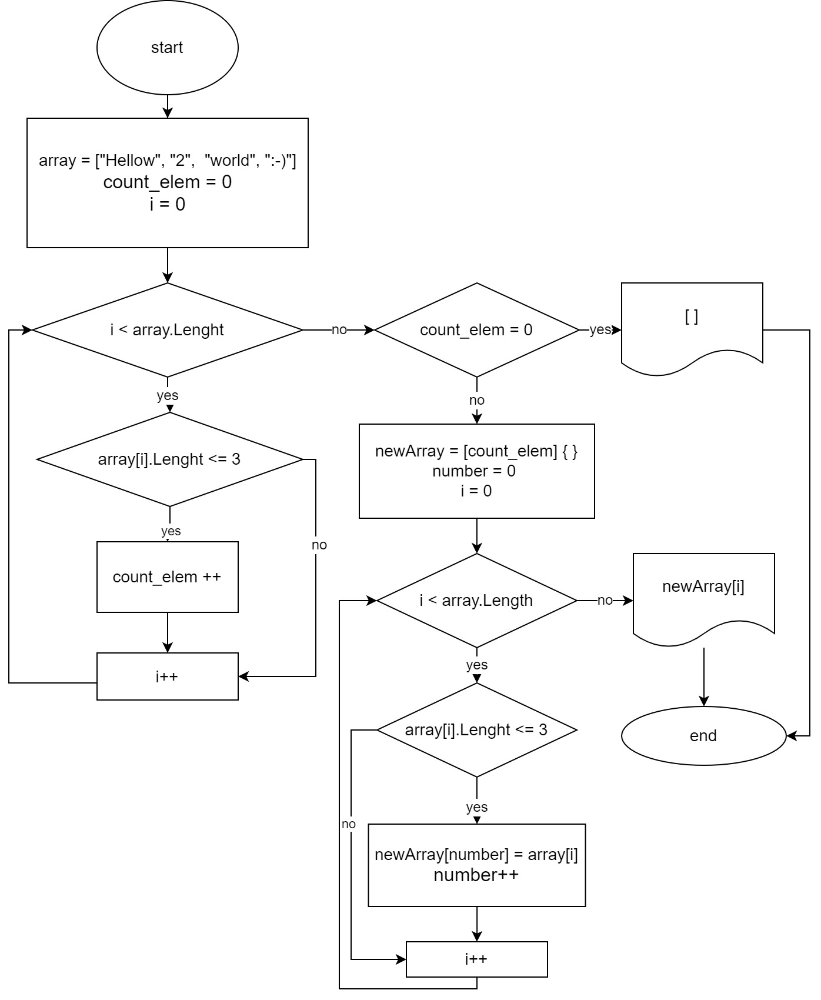

# Итоговая контрольная работа
## Задача
Написать программу, которая из имеющегося массива строк формирует новый массив из строк, длина которых меньше, либо равна 3 символам. Первоначальный массив можно ввести с клавиатуры, либо задать на старте выполнения алгоритма. При решении не рекомендуется пользоваться коллекциями, лучше обойтись исключительно массивами.

## Решение
* **Создаём массив строк.**
* **Определяем длину нового массива.**
Проходимся по каждому элементу и проверяем его количество символов. Считаем количество тех, у которых их меньше или равно 3-м.
* **Создаём новый пустой массив** с нужным количеством пустых ячеек.
* **Заполняем новый массив** элементами с количеством символов меньше или равно 3-м.
* **Выводим новый массив на экран.**

## Блок-схема
